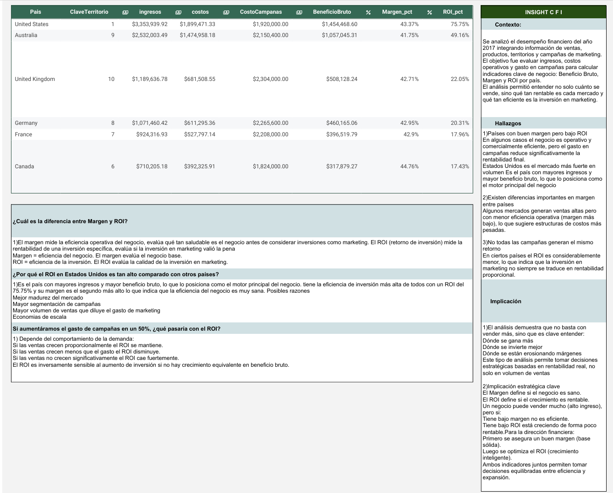

# Proyecto: Analisis de desempeño financiero con SQL Bootcamp Data Analyst TripleTen 2026 

## Objetivoo

Proyecto enfocado en el análisis del desempeño financiero de una empresa mediante consultas SQL sobre bases de datos relacionales. Se desarrollaron métricas clave y reportes ejecutivos para identificar tendencias, evaluar resultados y facilitar la toma de decisiones.

## Archivo utilizado

•	Proyecto_ Análisis del desempeño financiero con SQL - Resumen ejecutivo.xlsx

•	Proyecto_ Análisis del desempeño financiero con SQL - Resumen ejecutivo.csv

## Dashboard

## Actividades realizadas

•	Exploración de bases de datos relacionales

•	Consultas SQL para filtrado y organización de datos

•	Cálculo de métricas financieras

•	Creación de tablas para análisis integrados

•	Dashboard en Excel

•	Desarrollo de reportes financieros ejecutivos

## Herramientas

•	SQL

•	KPIs financieros

•	Reporting

•	GitHub

## Resultados

•	Identificación de ingresos, costos y utilidades por periodo

•	Creación de indicadores clave de desempeño financiero

•	Integración de datos en tablas consolidadas para análisis

•	Elaboración de un reporte ejecutivo con hallazgos y recomendaciones
